<link href="./markdown.css" rel="stylesheet"></link>
# Banshee #
## Web UI Overview ##
* NR.Login

	  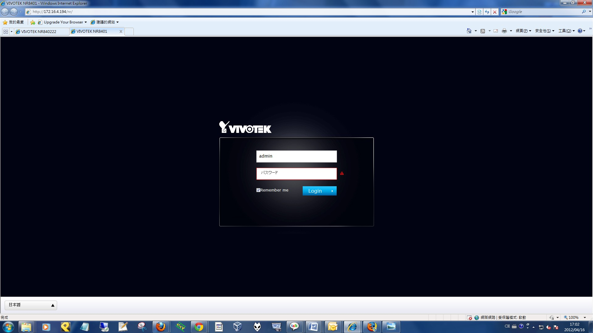

* NR.Liveview

	 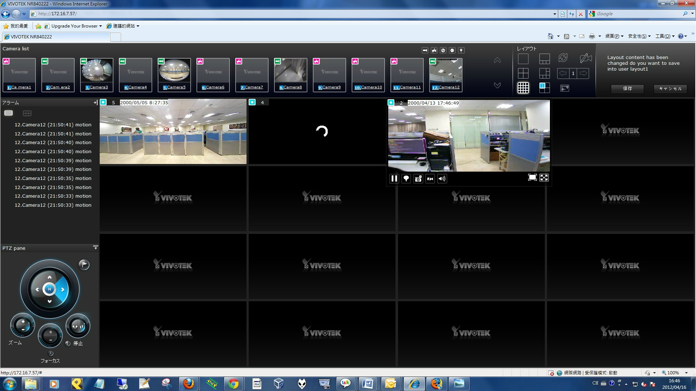  

* NR.Playback

	 

* NR.Settings

	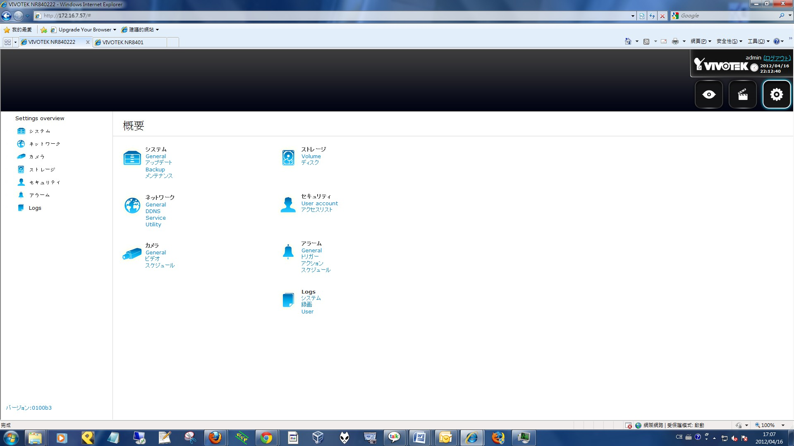  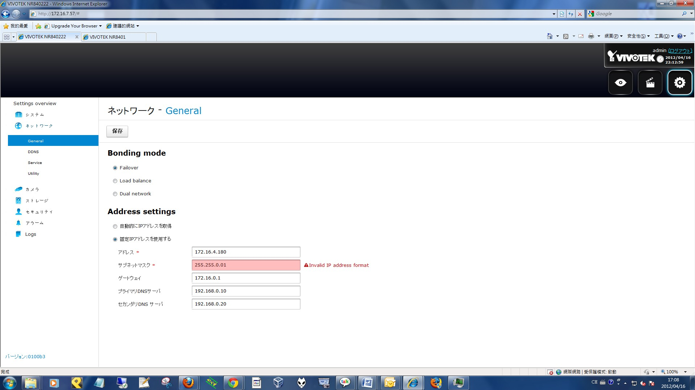    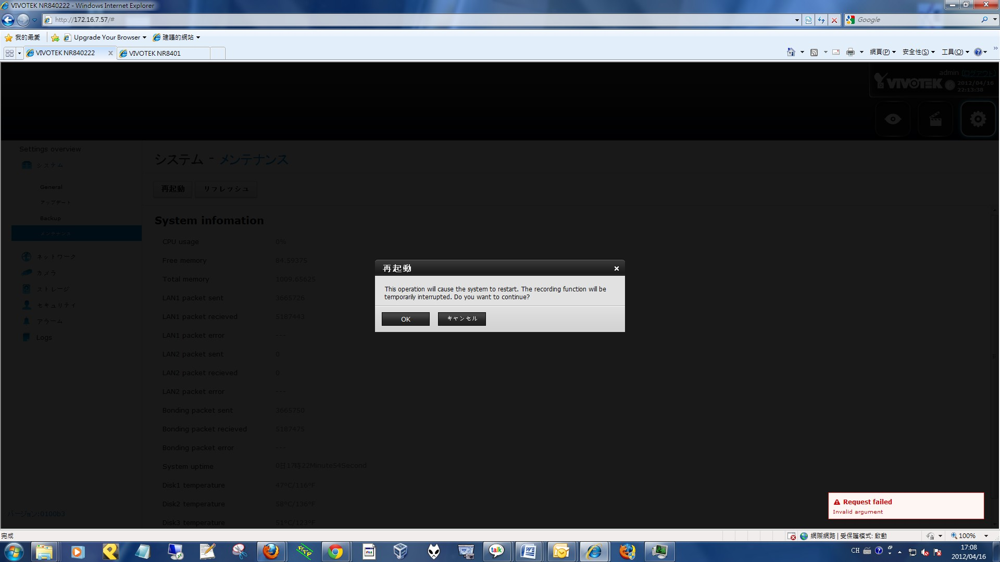  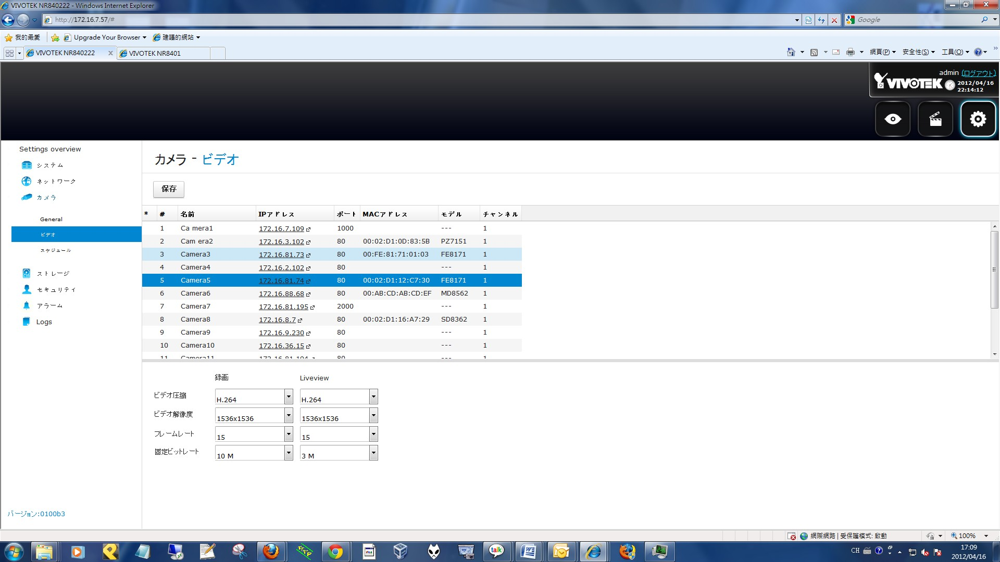  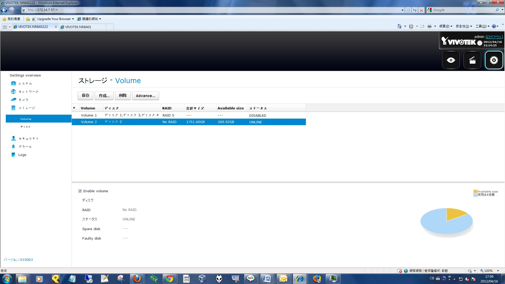  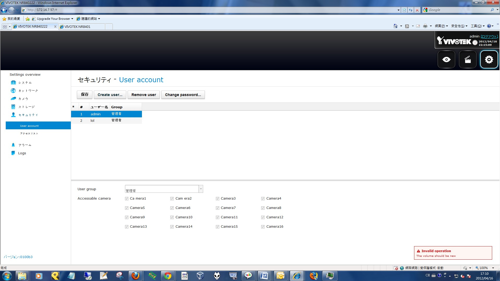  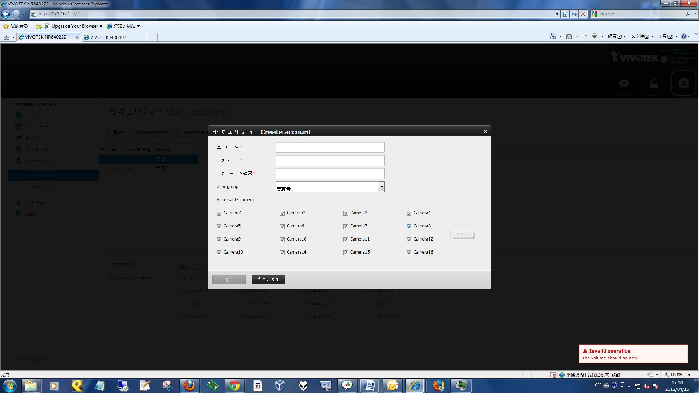  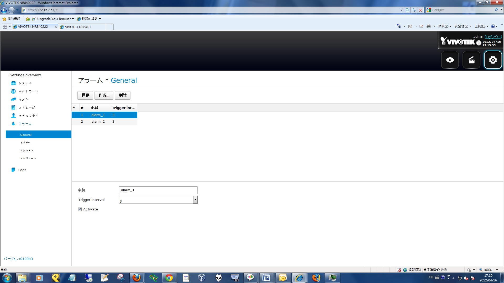 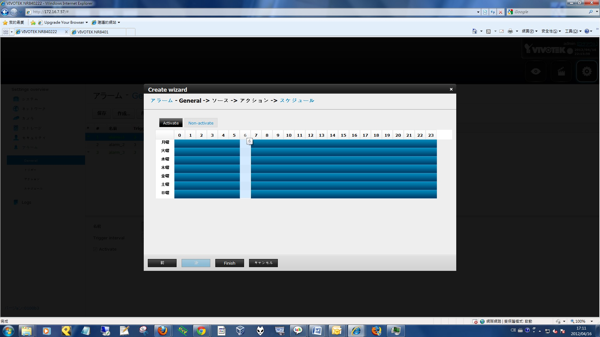 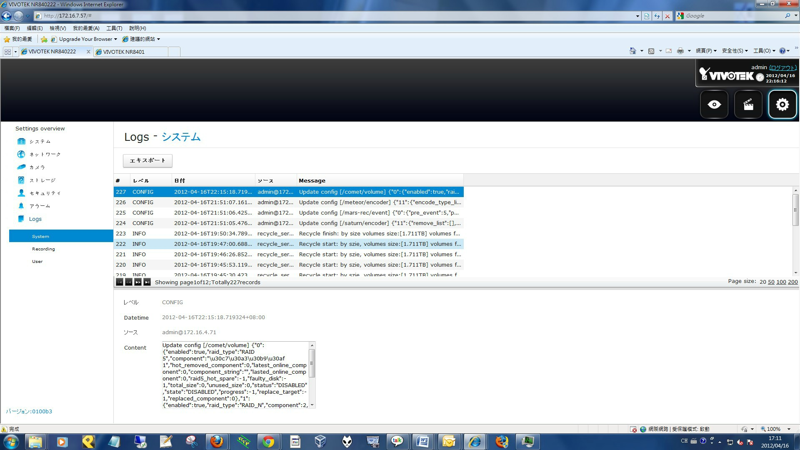

## Introduction ##
Banshee is a client-side web framework, constructed under javascriptMVC.
### javascriptMVC ###
* reference: [http://www.javascriptmvc.com](http://www.javascriptmvc.com)
## Structrure of Banshee ##
* Widget relation generated by graphiz 
** 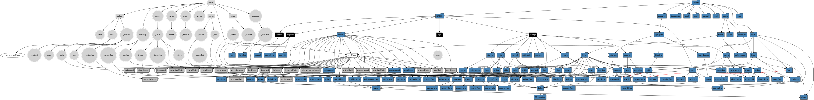
* jquery - jquery.js
* nr - all controllers/models/views 
* resource - external jquery libs/images/css
* steal - build env/lib dependency solution
## jQuery ##
* Version: 1.7.1
* News features used in the project: Deferred, on/off, animate, ....
### Model/Controller/View ###
Please reference to javascriptmvc document.
## Development mode ##
When in development mode, the javascript is controlled by stealJS.
## Production mode ##
After building process, the procudtion is built into www folder.
The following files will be generated:
### *.core.js ###
All javascript is combined into this file, regarding library dependancy, the order of javascript file is kept.
### prodcution.css ###
All dynamic less files and static css files are generated and combined into this files.
We don't use less css's dynamic feature here.
## Dynamic CSS ##
In order to solve css rule collision, a dynamic css is used.
It's LESS.
### Less ###
* Reference: [http://lesscss.org](http://lesscss.org)
* Features used: Nested rules, variables.

